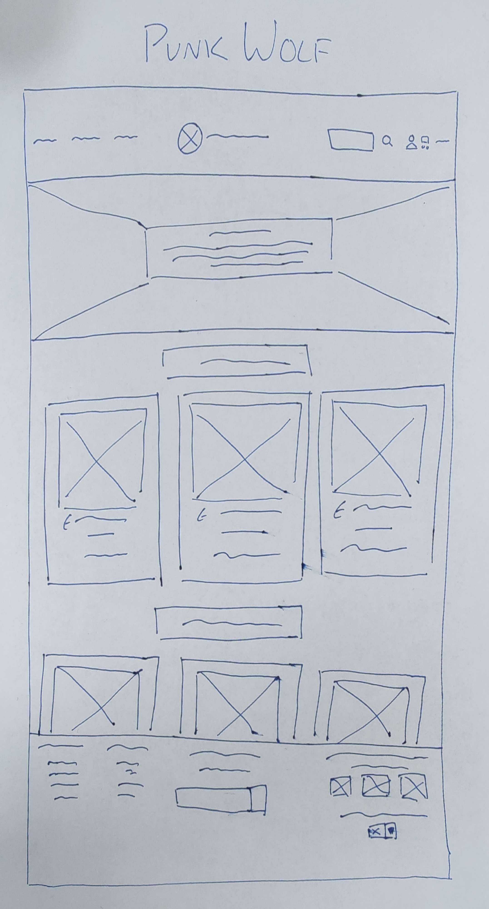

# Punk Wolf

------------------------------------------------------------------------------------

## About

I am making a shopping website for the brand Punk Wolf. It sells clothes and clothing DIY materials at an affordable price. The target audience is those within the punk/alt/lgbt community looking to find affordable clothes that wont break the bank along with materials to maintain and customise their clothes. I want things to be easily accessible as a lot of people in the communities I want to use my site have disabilities. Using HTML to contain all of the info, CSS to style things, JavaScript to return the newsletter email back to the user and to change the site currency, and EXPRESS to test the site js as I work. I plan on using Clip Studio EX to make an animation for the banner.

------------------------------------------------------------------------------------

## How to run project

To get the project running using Express, you need to use npm run server:dev. From there enter localhost:9000 into the browser bar

------------------------------------------------------------------------------------

## Planning

### Task: A short paragraph to describe how the project was planned

To plan my project I thought about the personas of people who may potentially use my site and created several different variations of wire-frames until I reached one I liked. I kept my to-do list in my notebook as well as leaving myself notes in my code to remind myself of where I left of and what I intended to add.  

------------------------------------------------------------------------------------

## Wireframes

This is the final wire-frame that I ended up using to base my project on

------------------------------------------------------------------------------------

## SEO

> Links do technically work but have no pages to go to. Without these places existing the links lead to nowhere.

> Page names will be kept short

> I have made efforts to keep the site optimised by keeping image and video file sizes small without compromising on the image quality. The site loads fast because I have not included any content that has no use when loaded

> At this moment in time there is no site-map due to additional pages not yet being created and connected to each other

> I have used appropriate HTML and header names on the HTML side of the website

> there is a newsletter available in the footer for people to sign up to

> if I were launching this product I would:
   - run a blog on the site with blog post previews on facebook and tumblr as a form of evergreen content
   - post short form videos on social media sites such as Tik Tok, Instagram and Facebook
   - interact with users on social media site to keep relevance and stay up to date on trends

> I would invest in ad space on social media sites, especially Tumblr and Tik Tok where I am aware of a huge amount of the punk/alt community spend their time. 

------------------------------------------------------------------------------------

## UX and Accessibility
  
> To help me understand the userbase I created personas that I felt represented users who would use my site
   --add image here. Need to take pictures as drawn physically--

> design patterns I used

> I used semantic HTML tags when possible to follow aria guidelines

> I made sure that my site is high contrast and readable for users with visual impairments

> To enable users to use my site without being confused, I made sure to keep the heuristics consistent. It resembles a shopping page on any other site with a search button, shopping basket, and page navigation in the top bar

> links are far enough apart that users shouldn't misclick the wrong items

> all images have alt tags for screen-readers

> I have avoided including pop-ups in my site to keep users on my site

> I have avoided flashing/strobe effects throughout the site including within animations to prevent any photosensitive based reactions among users

------------------------------------------------------------------------------------

# Current To-Do List

> Create animation for a banner

> fix hover over basket icon showing above normal basket icon

> Use JavaScript and API on the currency selector to change the currency across the page

> pick a font to use

> continue formatting with CSS
   - welcome banner aligned to the vertical centre with an animation playing behind it
   - get all products laid out within thumbnails and have thumbnails laid out on the page
   - footer. Links on the left, newsletter in the center, and the money related things on the right. Add a copyright at the bottom

> have a "buy now" button appear on the product image mouseover 

> continue updating readme

> if there is enough time I would like to add a horizontal bar featuring product categories that shows when hovering the product option in the navbar

> optimise site for mobile devices

------------------------------------------------------------------------------------

### Additional Resources

On top of your classnotes, your revision materials, and the links shared on Slack, these resources may be helpful:

- [Markdown Cheatseet](https://www.markdownguide.org/cheat-sheet/)
- [Tips on writing good Readme files](https://www.freecodecamp.org/news/how-to-write-a-good-readme-file/)